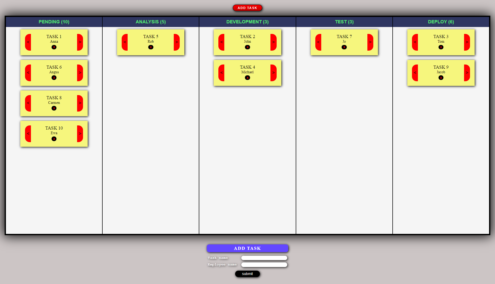

# Kanban Board

Welcome to my Kanban Board project. This project is designed to help users manage their work and improve their workflow.
Features

- The board is divided into columns, each representing a different stage of the work process.
- Tasks are represented by cards, and the card's position on the board represents its current stage of completion.
- Limit of tasks for each column is applied.
- Local Storage is used for data persistency.
- Function components, hooks, and context API are used for building the project.
- ESLint is used for code linting.

Live: [Live Demo](https://magnificent-sorbet-3b9e63.netlify.app)

Getting Started

To get started with this project, you will need to clone the repository and install the necessary dependencies.

    npm install

Once the dependencies have been installed, you can start the development server by running the following command:

    npm start

